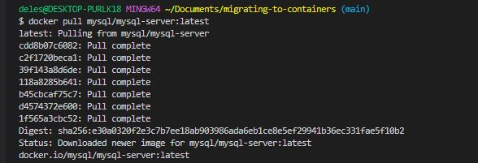
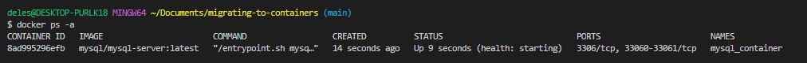
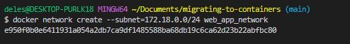
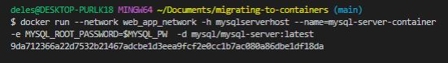
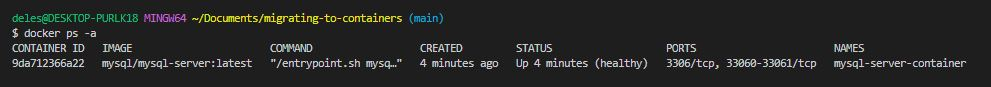

## Moving from a mysql web based application from a VM solution to a containerised one
---
### WE will first need to pull the MySQL base image from the Docker Hub Registry
### .

```
docker pull mysql/mysql-server:latest
```


### The next step is to deploy the new MySQL container by running it
```
docker run --name mysql-server-container -e MYSQL_ROOT_PASSWORD="Olupero2023%mysql" -d mysql/mysql-server:latest
```
### some-mysql is the name you want to assign to your container, my-secret-pw is the password to be set for the MySQL root user and tag is the tag specifying the MySQL version you want.

### Let's check docker containers that are running using docker ps -a
```
docker ps -a
```


### Next we shall create a mysql client container and a mysql server container.
# First let us create the network they will be attached to.

### I stopped and removed the previously created container and verified the removal
```
docker ps -a
docker stop mysql-server-container
docker rm mysql-server-container
```

### I will create a network which is of  DRVER type Bridge  by default

```
docker network create --subnet=172.18.0.0/24 web_app_network
```

### Network created successfullly



### For security, I will create an environment variable to store the root password
```
export MYSQL_PW=<mychosenpassword>
```
### Now we can pull the image and run/deploy tghe container in the new network ad pass in the password variable

```
docker run --network web_app_network -h mysqlserverhost --name=mysql-server-container -e MYSQL_ROOT_PASSWORD=$MYSQL_PW  -d mysql/mysql-server:latest
```

```
-h hostname
--network connects container to a network
-d runs the container in detached mode


```



```
docker ps -a
```



### it is best practice not to connect to the MySQL server remotely using the root user. Therefore, we will create an SQL script that will create a user we can use to connect remotely.

### Create a file and name it create_user.sql and add the below code in the file:
```
touch create_user.sql
```
### Put the script in create_user.sql
```
CREATE USER ''@'%' IDENTIFIED BY ''; GRANT ALL PRIVILEGES ON * . * TO ''@'%';
```
Run the sql script to create the user
```
docker exec -i mysql-server mysql -uroot -p$MYSQL_PW < create_user.sql
 ```

 ### I will spin another container using the same mysql image to launch a mysql client container
```
 docker run --network web_app_network --name mysql-client-container -it --rm mysql mysql -h mysqlserverhost -u  -p
 ```